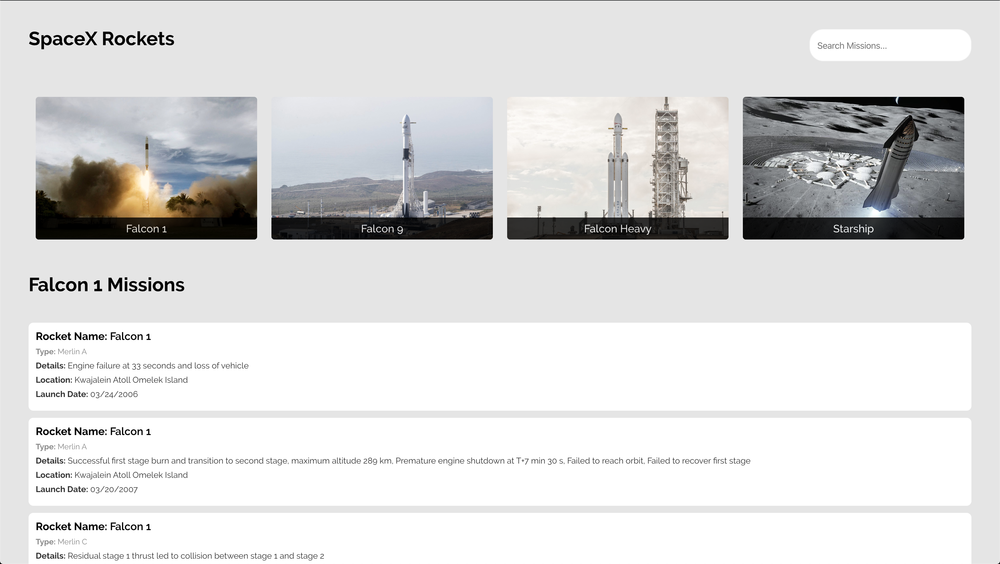

# Soma Capital Code Test

This project is a code test to pull data from the SpaceX API and display some data.  
[https://docs.spacexdata.com/?version=latest#intro](https://docs.spacexdata.com/?version=latest#intro)

There should a list of rocket types pulled from the api displayed up top.

By default the page should show all missions in a list form below the rockets.

Then when you click on a rocket fetch all the missions for that particular rocket type.

The project should display the launch date, mission details, rocket type, as well as
launch location on the cards.

The search bar in the upper right hand side should be able to search the currently displayed missions
by both rocket_type and details and should be case insensitive.

The application should be styled like the included image in the docs folder as demo.png.

You should also make the project responsive for all screen sizes and should look good on all.

The project should use redux as its been added for you with a sample increment function in the code base.

## Extra points

Extra points for pulling other data from the api and displaying it to add value to the application.

## Running the Application

In the project directory, you can run:

### `yarn start`

Runs the app in the development mode. 
Open [http://localhost:3000](http://localhost:3000) to view it in the browser.

The page will reload if you make edits. 
You will also see any lint errors in the console.
